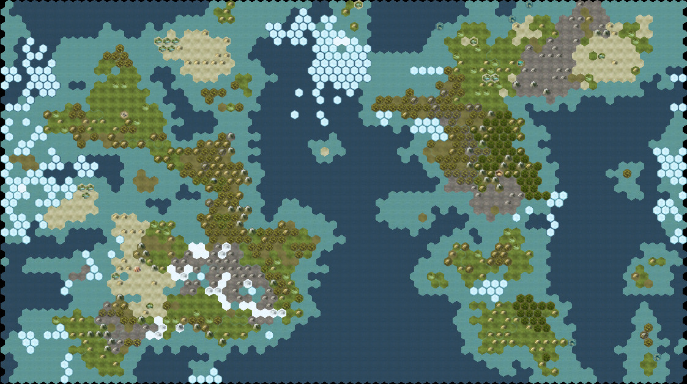
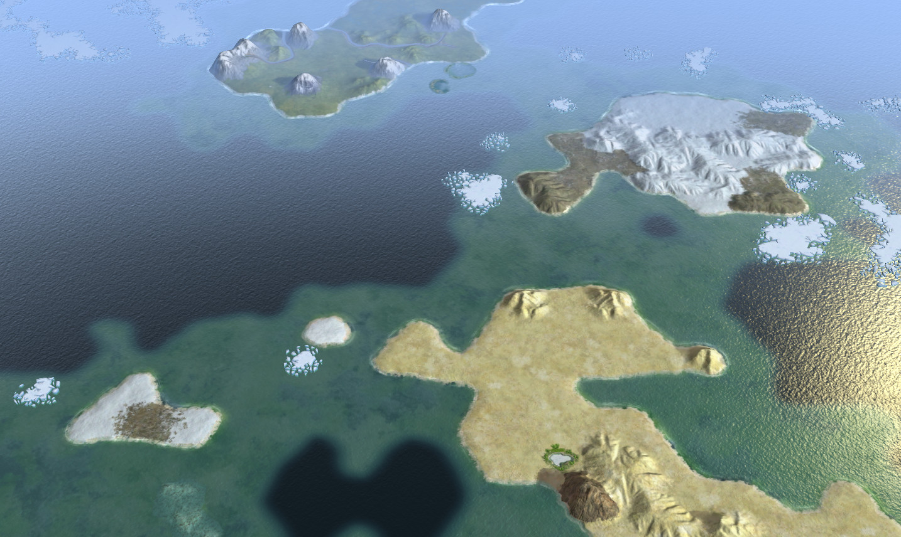

# Fantastical
## Map Script for Civilization 5

Fantastical lands! Convoluted rivers! Epic mountain ranges!

Maps with not much bearing on reality. Vast jungles next to icy wastes, etc. Mountains tend to divide regions of differing terrain. Number of deep oceans (requiring Astronomy research to cross) is controllable.

The map is a rendering of a polygonal world--a smaller map is just a lower resolution, therefore has smaller continents, regions, mountain ranges, rivers, etc.

It is possible to enable Climate Realism, but it's no Planet Simulator or Perfect World. The "realism" is a simple model based entirely upon latitude, with a little randomness.

### Custom Options

*World Wrap:* The map can be either a Globe with east-west wrapping, or a Realm with no wrapping

*Oceans:* The number of deep oceans that cannot be crossed without Astronomy. (On Realm maps this means the number of sides with ocean, i.e., 3 makes a peninsula, 4 makes an island.)

*Continents/Ocean:* The number of large continents per ocean. (On Realm maps this doesn't do anything.)

*Islands:* How many large and small islands. More islands has a side effect of smaller continents.

*Climate Realism:* No creates any kind of terrain wherever (including ice in the ocean). Yes puts ice at the poles and creates an earth-like climate.

*Fallout:* Place occasional areas of fallout on the map.

*World Age*, *Temperature*, *Rainfall*: All of these have more than the normal number of options to choose from.