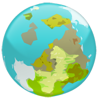

#  Fantastical
## Map Script for Civilization 5

Maps with not much bearing on reality. Vast jungles next to icy wastes, etc. Mountains tend to divide regions of differing terrain. Number of deep oceans (requiring Astronomy to cross) is controllable.

The map is a rendering of a polygonal world--a smaller map is just a lower resolution, therefore has smaller continents, regions, mountain ranges, rivers, etc. The number of polygons that make up the world of is controllable with the **Granularity** option.

Names can be given to places on the map with the dependent mod [Fantastical Place Names](http://steamcommunity.com/sharedfiles/filedetails/?id=314699759). Just enable that mod, and names will be revealed when tiles are explored, and persist through savegames.

It is possible to enable Climate Realism, but it's no Planet Simulator or Perfect World. The "realism" is a simple model based entirely upon latitude, with a little randomness.

This script (version 6) is compatible with [Alpha Centauri Maps](http://steamcommunity.com/sharedfiles/filedetails/?id=220026971). To create a map similar to Map of Planet, set **Landmass Type** to *Alpha Centaurish*, **Land at Poles** to *No*, and **Climate Realism** to *On*.

### [Steam Workshop](http://steamcommunity.com/sharedfiles/filedetails/?id=310024314)

### Installation & Use

#### Method One

Place Fantastical-dev.lua into Documents\my games\Sid Meier's Civilization 5\Maps\

The map will show up as "Fantastical (dev)" in the game setup dialogue.

#### Method Two

Subscribe to the [Steam Workshop](http://steamcommunity.com/sharedfiles/filedetails/?id=310024314). In Mods, enable Fantastical. The map will show up as "Fantastical".

### Custom Options

**Landmass Type**: The arrangement of land and oceans. The first half of the options (*Land All Around* to *Random Globe*) are globes that wrap east to west. The second half (*Dry Land* to *Random Realm*) are realms that do no wrap.

**Land at Poles**: Whether or not land is placed at the top and bottom hexes of the map.

**Climate Realism**: If set to *On*, latitudes will more or less determine terrain. Left at *Off*, it is entirely possible that jungles will occur at the poles.

**Granularity**: How many polygons make up the world. Higher granularity will create smaller regions, more isolated islands, and straighter, thinner ocean rifts.

**World Age**, **Temperature**, **Rainfall**: All have more than the usual number of options. **World Age** goes from *1 Billion Years* to *6 Billion Years*, **Temperature** from *Snowball* to *Global Tropics*, and **Rainfall** from *Arrakis* to *Arboria*.

**Doomsday Age**: How long ago has did this world pass through destruction? This controls the placement of city ruins, roads, and fallout.